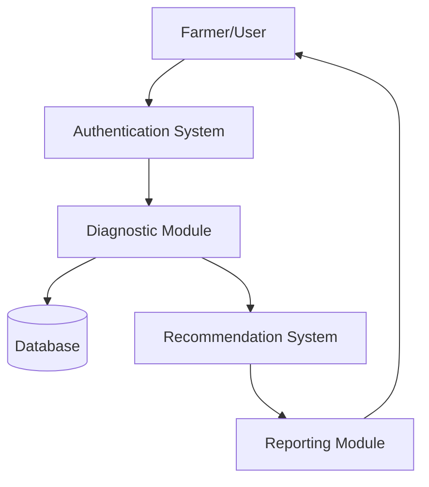
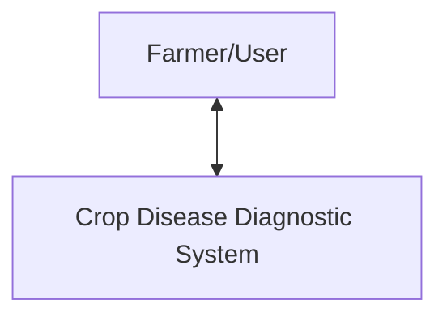
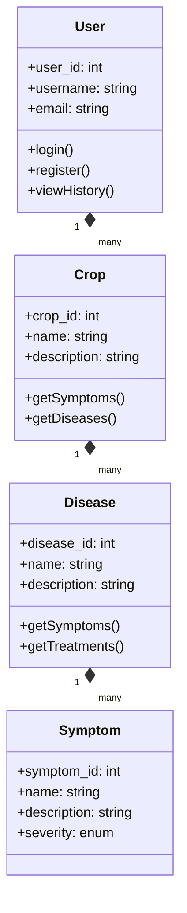
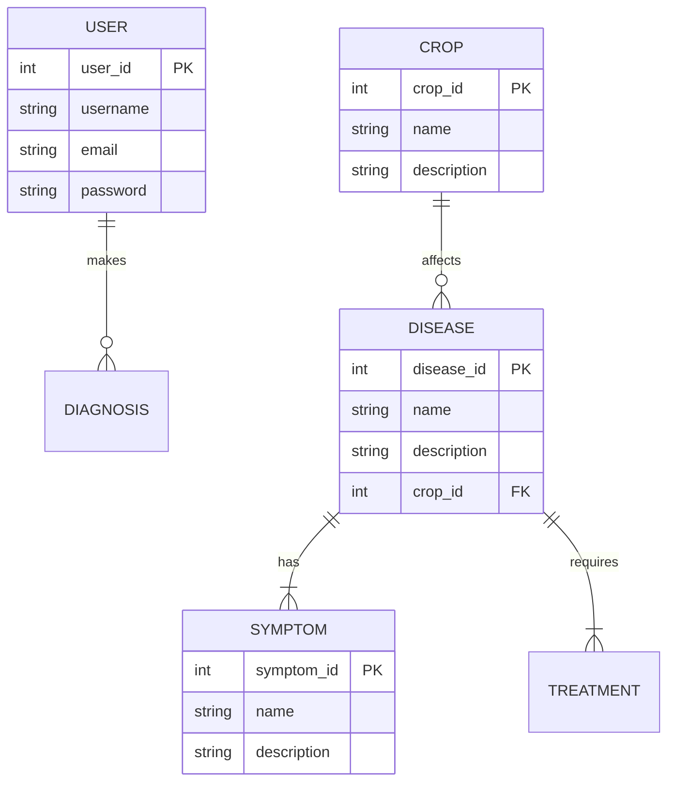
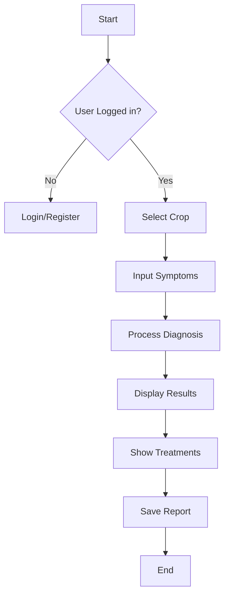

# Crop Disease Diagnostic Tool - Project Documentation

## Table of Contents
1. Project Overview
2. Group Members
3. Technical Scope
4. Problem Statement
5. System Architecture
6. Database Structure 
7. Diagrams
   - Context Diagrams (Level 0 & 1)
   - UML Diagrams
   - Entity Relationship Diagram (ERD)
   - Flowcharts
8. Core Functionalities
9. Implementation Details
10. ScreenShoots
11. Deployment
12. Conclusion

## 1. Project Overview
The Crop Disease Diagnostic Tool is a web-based application designed to help farmers identify and manage crop diseases. The system provides an intuitive interface for symptom-based disease diagnosis, comprehensive disease information, and treatment recommendations.

## 2. Group Members

*Group Members*

## 3. Technical Scope
### Technologies Used:
- Frontend: HTML5, CSS3, JavaScript, Bootstrap
- Backend: PHP
- Database: MySQL
- Development Tools: Visual Studio Code, WAMP


### System Requirements:
- Web Server: Apache
- PHP Version: 7.4 or higher
- MySQL Version: 5.7 or higher
- Modern web browser with JavaScript enabled

## 4. Problem Statement
Agriculture faces significant challenges due to crop diseases that can devastate yields and farmer livelihoods. Key issues include:
- Difficulty in accurately identifying crop diseases
- Limited access to agricultural experts
- Delayed disease detection leading to crop losses
- Lack of immediate access to treatment information
- Need for a centralized knowledge base for disease management

## 5. System Architecture
The system follows a three-tier architecture:

### Presentation Layer
- User Interface components
- Forms for symptom input
- Disease information display
- Treatment recommendations interface

### Application Layer
- Disease diagnosis logic
- User authentication
- Session management
- Data validation and processing

### Data Layer
- MySQL database
- Data access objects
- Query processing
- Data storage and retrieval

## 6. Database Structure

### Core Tables
1. `users`
   - id (PK)
   - username
   - email
   - password
   - created_at

2. `crops`
   - id (PK)
   - name
   - scientific_name
   - description
   - common_varieties
   - created_at

3. `diseases`
   - id (PK)
   - name
   - scientific_name
   - description
   - severity_level (enum: Low, Moderate, High)
   - treatment_info
   - prevention_info
   - created_at

4. `symptoms`
   - id (PK)
   - name
   - description
   - severity (int)
   - created_at

### Junction Tables
5. `disease_symptoms`
   - disease_id (FK)
   - symptom_id (FK)
   - weight (int)

6. `diagnosis_symptoms`
   - diagnosis_id (FK)
   - symptom_id (FK)
   - severity_level (int)

### Management Tables
7. `growth_stages`
   - id (PK)
   - name
   - description
   - duration_days
   - created_at

8. `recommendations`
   - id (PK)
   - disease_id (FK)
   - recommendation (text)
   - type (enum: Prevention, Treatment, Management)
   - priority (int)

9. `diagnoses`
   - id (PK)
   - user_id (FK)
   - crop_id (FK)
   - disease_id (FK)
   - growth_stage
   - confidence
   - additional_details
   - created_at
   - status (enum: identified, unidentified)

## 7. Diagrams

### Context Diagram Level 0


### Context Diagram Level 1


### UML Diagrams


### Entity Relationship Diagram (ERD)


### Flowcharts


## 8. Core Functionalities

### 8.1 User Authentication
- Secure login and registration system
- Password encryption using bcrypt
- Session management
- User profile management

### 8.2 Disease Diagnosis
- Symptom-based diagnosis using weighted algorithm
- Support for multiple symptoms selection
- Growth stage consideration
- Confidence score calculation
- Image-assisted diagnosis (future enhancement)

### 8.3 Crop Management
- Comprehensive crop database with 20+ crops
- Scientific names and common varieties
- Growth stage tracking
- Crop-specific disease susceptibility information

### 8.4 Treatment Recommendations
- Prioritized treatment suggestions
- Preventive measures
- Management practices
- Organic and chemical treatment options
- Success rate indicators

### 8.5 Reporting System
- Diagnosis history
- Treatment tracking
- Export functionality (PDF reports)
- Statistical analysis of diagnoses

## 9. Implementation Details

### 9.1 Database Design Considerations
1. **Normalization**
   - Third Normal Form (3NF) compliance
   - Proper relationship mapping
   - Referential integrity constraints

2. **Performance Optimization**
   - Indexed key fields
   - Optimized query structures
   - Efficient data retrieval patterns

3. **Security Measures**
   - Prepared statements for SQL injection prevention
   - Input validation
   - Data sanitization

### 9.2 Key Algorithms

#### Disease Diagnosis Algorithm

-- Sample Test Query for Diagnosis Accuracy
SELECT d.name as disease, 
       COUNT(di.id) as diagnosis_count,
       AVG(di.confidence) as avg_confidence
FROM diseases d
JOIN diagnoses di ON d.id = di.disease_id
GROUP BY d.id
HAVING avg_confidence > 70
ORDER BY diagnosis_count DESC;

### API Endpoints
```php
// Authentication
POST /api/auth/login
POST /api/auth/register

// Diagnosis
GET  /api/crops
POST /api/diagnose
GET  /api/diseases/{id}

// Recommendations
GET  /api/treatments/{disease_id}
```


## 10. Screenshots

### 10.1 User Interface

*Figure 1: User Welcome page interface*


*Figure 1: User authentication Login interface*


*Figure 1: User authentication SignUp interface*


*Figure 2: Main dashboard showing crop selection*


*Figure 2:User profile Main dashboard showing*


*Figure 3: Disease diagnosis interface with symptom selection*


*Figure 4: Diagnosis results with treatment recommendations*

### 10.2 Database Management

*Figure 5: MySQL database schema visualization*


 

## 11. Deployment

### 11.1 System Requirements
- Apache 2.4 or higher
- PHP 7.4+
- MySQL 5.7+
- 2GB RAM minimum
- 10GB storage minimum

### 11.2 Installation Steps

1. Import database schema
2. Configure environment variables


      

## 12. Conclusion

The Crop Disease Diagnostic Tool successfully addresses the critical need for accessible and accurate crop disease diagnosis. Through its implementation of:
- User-friendly interface
- Accurate diagnosis algorithms
- Comprehensive disease database
- Treatment recommendations
- Detailed reporting

The system provides farmers with a valuable tool for crop disease management and yield protection.
